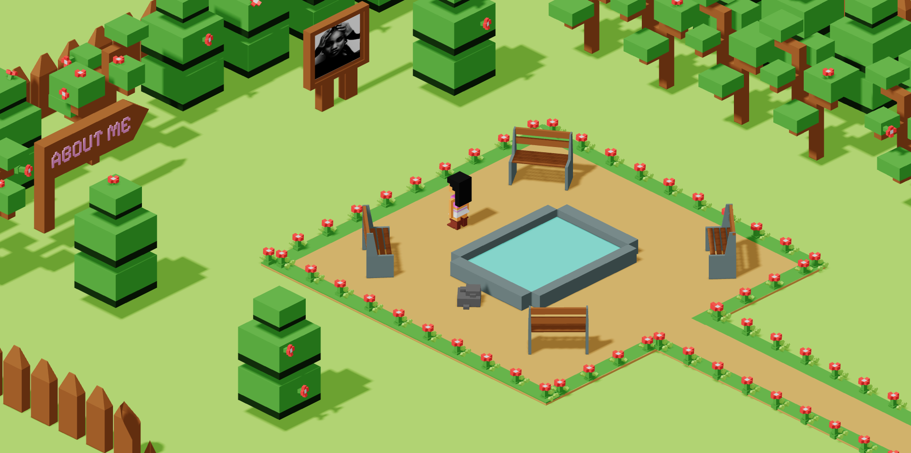
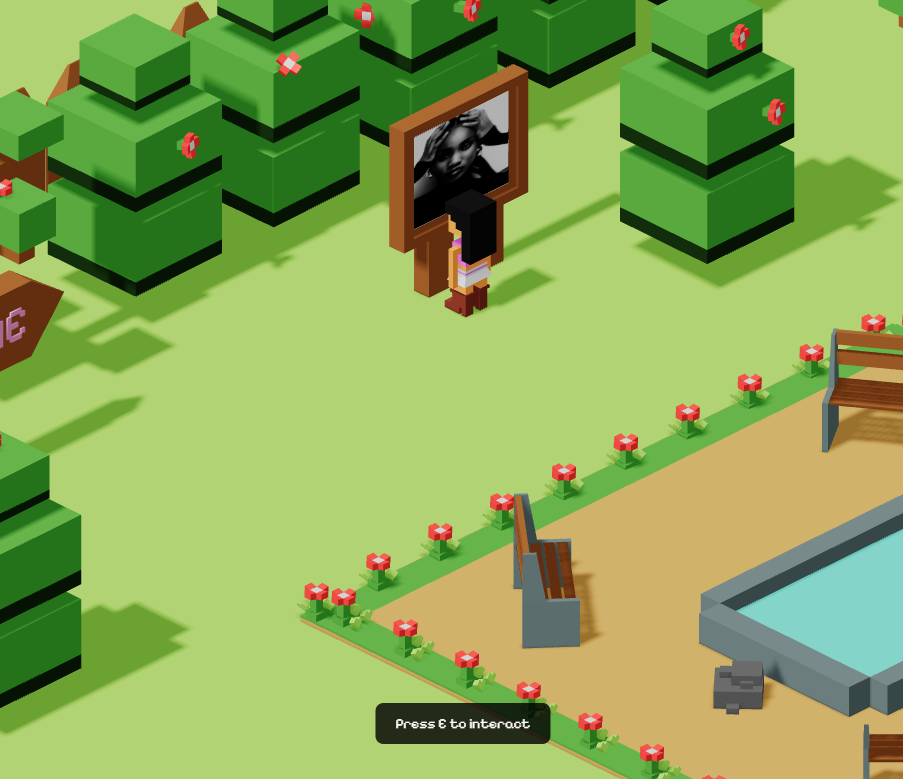
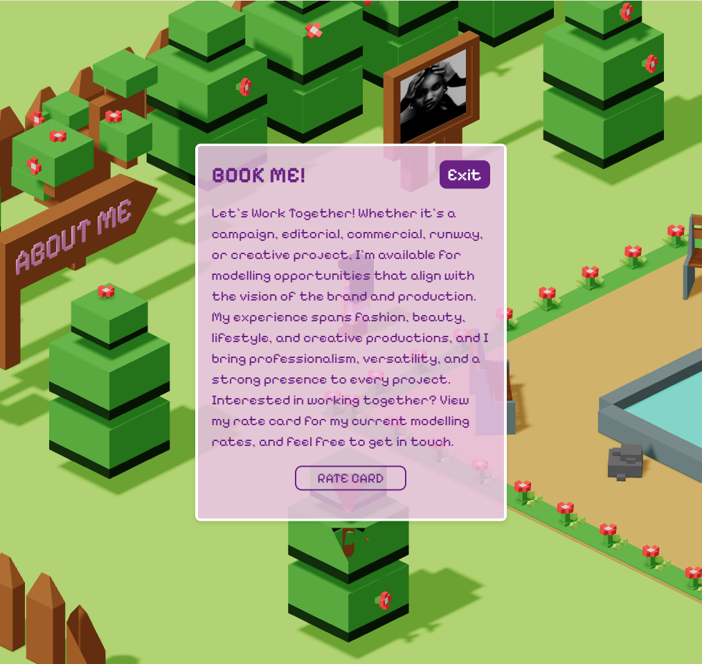
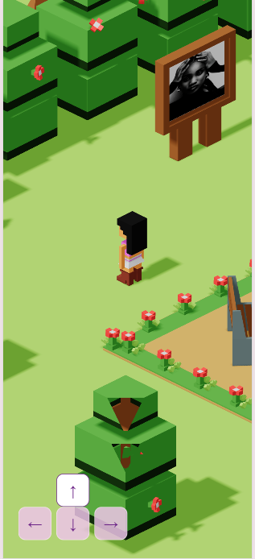

# Gini's Park

### An Interactive 3D Portfolio Experience

An interactive 3D portfolio website built with Three.js, JavaScript, HTML, CSS, and Blender.

[🌐 Live Demo](https://ginis-park.netlify.app)

---

## About

Gini's Park is an interactive 3D portfolio experience where visitors can explore a virtual environment, control a character, interact with objects, and discover my modelling work.

The project combines real-time 3D graphics with traditional web technologies to create an interactive portfolio experience.

---

## Features

- Interactive 3D environment
- Character movement
- Gravity and jumping
- Capsule-based character collision
- Octree environment collision detection
- Raycasting interactions
- Proximity-based interaction prompts
- Interactive HTML modal system
- Keyboard controls
- Mobile touch controls
- Responsive camera
- 3D-to-HTML UI positioning
- GLB model integration
- Blender-created 3D assets

---

## Experience

### Explore the Environment

The portfolio is presented as an explorable 3D environment rather than a traditional static website.

### Interactive Environment

Users can move around the environment and approach interactive objects to discover additional content.

### Interactive Portfolio Modal

Interactive objects can trigger HTML-based interface elements containing portfolio and booking information.

### Mobile Experience

The experience also supports mobile interaction through on-screen directional controls.

---

## Controls

### Desktop

| Key | Action |
|---|---|
| `W` / `↑` | Move up |
| `S` / `↓` | Move down |
| `A` / `←` | Move left |
| `D` / `→` | Move right |
| `E` | Interact |
| `R` | Respawn |

### Mobile

Use the on-screen directional controls to move around the environment.

---

## Built With

- Three.js
- JavaScript
- HTML
- CSS
- Blender
- WebGL

---

## What I Learned

This project helped me gain practical experience with:

- Loading and working with GLB models in Three.js
- Building and configuring a 3D scene
- Working with cameras, lighting, and rendering
- Implementing character movement
- Working with Capsule collision detection
- Using an Octree for environment collisions
- Implementing gravity and jumping
- Using Raycaster for 3D interactions
- Connecting DOM elements with a 3D scene
- Converting 3D positions into screen coordinates
- Handling desktop and mobile input
- Building responsive 3D experiences

---

## Challenges

Some of the main challenges I worked through during development included:

- Implementing reliable character collision
- Keeping the character movement and physics synchronized
- Creating smooth character rotation
- Making interactions work correctly on both desktop and mobile
- Preventing clicks on non-interactive parts of the scene from triggering modals
- Connecting the 3D environment with traditional HTML/CSS interface elements
- Managing camera positioning while the character moves

## Author

Olua Ginikachi

[Instagram](https://www.instagram.com/ginikaolua/)
